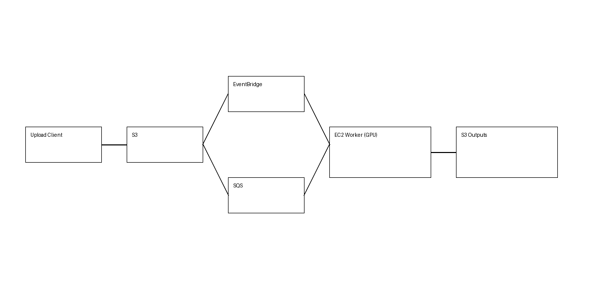

# 🌊 Kelp Forest Monitoring Pipeline


---

## 🏗️ Architecture Diagram



---

## 📸 Example Output

### Annotated Video Frame


### Data Output (CSV)


---

## Overview

This project implements a fully automated, event-driven data pipeline for processing underwater video data.

---

## Key Features

- Event-driven ingestion (S3)
- Distributed processing (SQS + EC2 GPU)
- ML pipeline (detection → tracking → annotation)
- Automated scaling (Lambda start/stop)
- Structured outputs (JSONL → CSV)

---

## Architecture

```
Upload → S3 → SQS → EC2 Worker → ML Pipeline → S3 Outputs
                ↑
          Lambda (start/stop)
```

---

## Outputs

- Annotated videos
- Detection + tracking JSON
- Per-run CSV
- Master CSV

---

## Run

```
sudo systemctl restart sqs-worker.service
sudo journalctl -u sqs-worker.service -f
```

---

## Notes

- Place `pipeline_architecture.png` in the root of your repo
- Replace placeholder images with real outputs for best presentation
